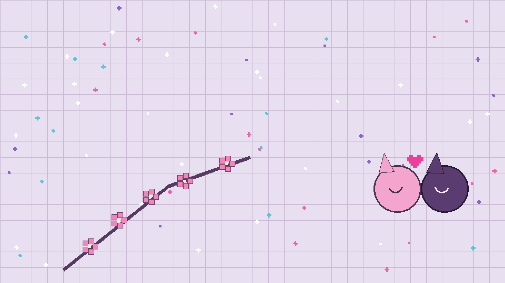
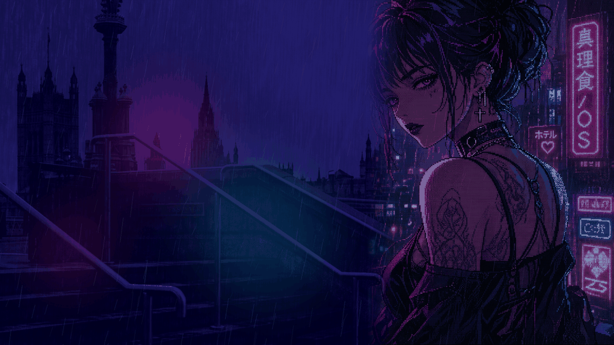
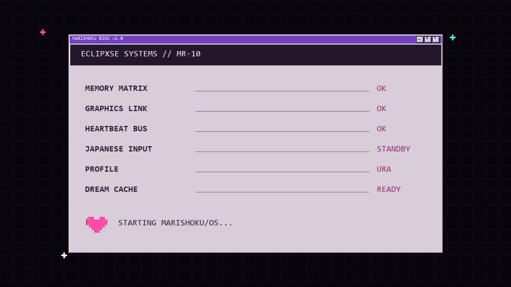

# 魔理蝕 // MARISHOKU/OS

MARISHOKU/OS is a Debian 13 operating-system remix with KDE Plasma 6. V1
rebuilds the complete visible path—boot hand-off, sign-in, desktop, Qt/GTK
applications, profiles, utilities, Japanese input, and installer—in one square
2x pixel language.

- System code: `MR-10`
- Device identity: `ECLIPXSE`
- Profiles: `表 / OMOTE` and `裏 / URA`
- Architecture: `amd64`

## V1 direction

- Windows 9x-style bevels and 26 px active titlebars
- handheld Japanese messaging UI
- cyber-kawaii color with soft-goth contrast
- intentional CRT/LCD texture on transitional surfaces only
- original adult gothic-anime heroine and 16-bit heart identity
- no fake windows baked into wallpaper
- no unlicensed mood-board images in the public repository or ISO







## What is implemented

- Plasma 6 Global Theme, Plasma Style, Aurorae, Kvantum, GTK 3/4, icons, and
  generated 32 px pixel cursors
- curated high-detail URA master plus deterministic OMOTE, recovery, cursor,
  boot-control, and sound assets
- reversible GRUB and Plymouth faux-BIOS sequence
- custom SDDM sign-in and Plasma splash; lock screen uses the selected profile
  wallpaper while retaining Plasma's audited authentication component
- atomic `marishoku-profile omote|ura` switcher
- Control Center, first-run Welcome, read-only system summary, safe Storage Care,
  and Japanese input guide
- Fcitx 5 + Mozc defaults while keeping the normal US keyboard as default
- Debian package builder and Debian live-build configuration
- Calamares installer branding based on Debian's maintained installer settings
- VirtualBox, QEMU/SPICE, firmware, UEFI, and Secure Boot build support

## Update the existing development VM

From the checked-out repository in Debian:

```bash
git fetch origin
git switch agent/marishoku-v1
git pull --ff-only
./tools/install-theme.sh --install-deps --apply --layout
```

Log out and back in once. Then test:

```bash
fastfetch
marishoku-profile omote
marishoku-profile ura
marishoku-center --page welcome
marishoku-center --page storage
```

The user installer changes only the current account, except when
`--install-deps` explicitly calls Debian's package manager. It does not touch
the VM bootloader or SDDM. Those system surfaces are tested through the package
or live ISO.

## Build the package

On Debian 13:

```bash
sudo apt update
sudo apt install --yes python3-pil xcursorgen dpkg-dev
python3 tools/build-v1-assets.py
./tools/build-package.sh
```

The result is `build/packages/marishoku-system_1.0.0-1_all.deb`.

## Build the live ISO

See [`iso/README.md`](iso/README.md). Short version:

```bash
sudo ./iso/build.sh
```

The build must run on Debian 13 with live-build installed. This Windows
workstation can validate the source and render every deterministic asset, but
it cannot execute the Debian chroot or honestly claim an ISO boot test.

## Repository map

```text
artwork/              Approved master art, wallpapers, sound, and source assets
docs/                 Visual specification, architecture, roadmap, and policy
iso/                  Debian live-build and Calamares image configuration
packages/             System apps, defaults, branding, and package metadata
profiles/             OMOTE and URA profile declarations
themes/               Boot, SDDM, Plasma, Qt, GTK, icon, cursor, and terminal UI
tools/                Asset, package, install, profile, layout, and validation tools
```

## Validate

On Windows:

```powershell
python tools/build-v1-assets.py
python -m py_compile tools/build-v1-assets.py packages/system-apps/marishoku_center.py
powershell -ExecutionPolicy Bypass -File tools/validate.ps1
```

On Debian, also build the cursor/package and run `shellcheck` on `tools/*.sh`,
`iso/*.sh`, and `iso/auto/*` before producing a release image.

## Safety

Development stays VM-first. Do not repartition the ECLIPXSE Windows drive,
change its bootloader, or install the experimental image on the host until the
VM install checklist passes twice and recovery media exists.
