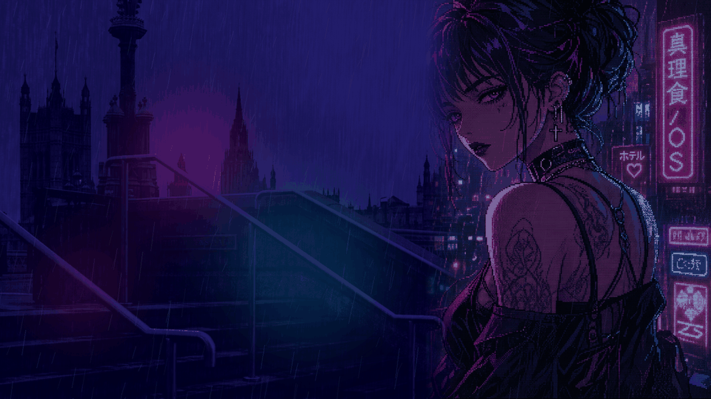

# 魔理蝕 // MARISHOKU/OS

`MARISHOKU/OS` is an installable Debian 13 remix built around KDE Plasma 6.
Its visual language combines hard-edged 1990s desktop chrome, handheld
messaging interfaces, pixel manga, CRT texture, and a magenta/cyan after-dark
palette.


## Identity

- Display name: `魔理蝕 // MARISHOKU/OS`
- System code: `MR-10`
- Device identity: `ECLIPXSE`
- Clean profile: `表 / OMOTE`
- After Dark profile: `裏 / URA`
- Primary architecture: `amd64`
- Base: Debian 13 stable
- Desktop: KDE Plasma 6 on Wayland

## Current milestone

Phase 1D is ready for exact-concept review in the
Debian VM. This repository currently contains:

- the approved visual and interaction specification;
- hardware and content-profile requirements;
- a contrast-checked Plasma 6 color system;
- a Global Theme and Aurorae window decoration;
- original Plasma shell SVGs for panels, dialogs, buttons, fields, tasks,
  selections, headings, arrows, separators, and tooltips;
- an original Kvantum Qt 5/6 control atlas for application interiors;
- the approved lavender Win9x taskbar, hot-magenta title bars, and heart launcher;
- a left-side pixel tool rail and fixed MARISHOKU/OS taskbar status block;
- a MARISHOKU Konsole profile, pink-heart Fastfetch identity, and URA dialog;
- two licensed, credited 1920x1080 London/cyber-goth wallpaper composites;
- Noto Sans/Mono typography with Japanese glyph fallback;
- installation and validation helpers.

The first ISO will be built only after the desktop theme passes visual review
inside a virtual machine.

## Repository map

```text
artwork/              Original source artwork and exports
docs/                 Product, visual, content, and hardware specifications
iso/                  Debian live-build configuration (Phase 2)
packages/             Debian packaging sources (Phase 2)
themes/               Plasma, Qt, GTK, SDDM, boot, icon, and cursor themes
tools/                Developer installation and validation helpers
```

## Test the Phase 1D desktop in a Plasma 6 VM

First-time setup installs the official Debian Kvantum, Fastfetch, and Noto packages:

```bash
./tools/install-theme.sh --install-deps --apply
```

Later theme-only updates do not need sudo:

```bash
./tools/install-theme.sh --apply
```

To deliberately rebuild the bottom taskbar and reset the wallpaper again:

```bash
./tools/install-theme.sh --apply --layout
```

Log out and back in once after the first application. The script installs into
the current user's home directory. Only `--install-deps` modifies the base OS,
through Debian's package manager.

After installation, plain `fastfetch` displays the MARISHOKU/OS pink pixel
heart instead of Debian's stock logo. If a personal Fastfetch config already
exists, the installer preserves it once as `config.jsonc.pre-marishoku.bak`.

## Included wallpaper profiles

The default Phase 1D wallpaper is derived from the exact approved concept. Its
baked fake windows were removed so the real Plasma windows can occupy the scene.




The shipped composites use approved project artwork, transformed Pexels
photography, and a public-domain ukiyo-e image. Full source links, authors, and
terms are recorded in `ASSETS.yml`; untouched source photos are not committed.

## Safety rule

Development is VM-first. No repartitioning, dual boot, NVIDIA driver changes,
or bootloader changes are performed on the ECLIPXSE host during theme development.
