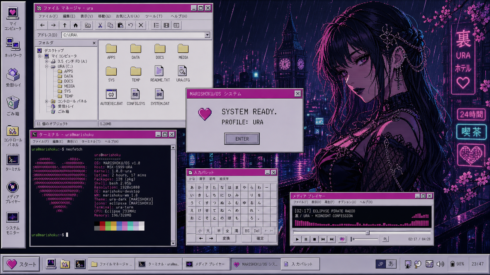

<div align="center">


# 魔理蝕 // MARISHOKU/OS

### Debian after dark.

A pixel-goth Debian 13 remix built around KDE Plasma 6, Japanese input,
square 1990s desktop chrome, and an original pink-and-cyan identity.

[](https://www.debian.org/)
[](https://kde.org/plasma-desktop/)


**SYSTEM CODE `MR-10` · DEVICE IDENTITY `ECLIPXSE` · PROFILES `表 / OMOTE` + `裏 / URA`**

</div>



> **NO ONE IS COMING. PUSH ANYWAY.**

> [!WARNING]
> MARISHOKU/OS is experimental software. The desktop and hybrid ISO build are
> working, but physical-hardware and installer validation are still in
> progress. Test the live session or use a disposable VM. Do **not** replace a
> primary Windows installation with this build.

## What is MARISHOKU/OS?

MARISHOKU/OS is a heavily customized Debian distribution—not a new kernel and
not a Linux system written from scratch. It keeps Debian's package ecosystem
and hardware support while replacing the visible experience from boot to
desktop:

- custom GRUB, Plymouth, SDDM, Plasma splash, lock-screen, and desktop styling;
- square Win9x-inspired chrome with pixel-snapped bevels and no glass or blur;
- a custom Plasma command launcher, left tool rail, status block, and taskbar;
- matching Plasma, Aurorae, Kvantum, GTK 3/4, icon, cursor, sound, and terminal
  themes;
- native Japanese input through Fcitx 5 and Mozc, with US English retained as
  the default keyboard;
- two atomic presentation profiles: public-safe **OMOTE** and owner-controlled
  **URA**;
- Calamares installer branding and a reproducible Debian `live-build` tree.

The name is deliberately constructed branding. `魔` gives the occult *ma*,
`理` gives system logic and *ri*, and `蝕` means eclipse, erosion, or being
consumed. The `O` in `/OS` completes the hidden **MA-RI-O** construction.
`MR-10` is the machine code.

## Current state

| Component | State |
|---|---|
| Plasma 6 desktop shell and complete application theme | ✅ Implemented |
| OMOTE / URA profile switching | ✅ Implemented |
| Japanese input defaults | ✅ Implemented |
| Custom launcher, Control Center, Storage Care, and Welcome | ✅ Implemented |
| Debian package build | ✅ Implemented |
| Debian 13 hybrid ISO build | ✅ Builds successfully |
| SHA-256 verification on Debian and Windows | ✅ Passed |
| BIOS and UEFI boot metadata | ✅ Detected in reference image |
| Live USB boot on target laptop | 🧪 Next test |
| Calamares installation and second-boot validation | ⏳ Pending |
| Intel/NVIDIA hardware beta | ⏳ Pending |
| Public release | ⛔ Not ready |

## Two faces of the same machine

| 裏 / URA | 表 / OMOTE |
|---|---|
| Owner-approved After Dark profile with darker artwork and stronger system copy. | Public-safe profile for streaming, classrooms, repair shops, and shared screens. |
|  |  |

Switch without maintaining two operating systems:

```bash
marishoku-profile ura
marishoku-profile omote
```

The switch changes presentation assets and selected copy. It never weakens
authentication or security settings. See the full
[content-profile policy](docs/CONTENT-PROFILES.md).

## The interface

- `26 px` active title bars and `54 px` desktop panel at 100% scale;
- zero-radius windows, one-pixel ink outlines, and two-stage bevels;
- magenta active chrome, lavender surfaces, cyan focus, and near-black depth;
- readable Noto fallbacks for documents and Japanese text;
- original 16-bit heart identity and generated pixel cursor family;
- intentional CRT texture on artwork and transition surfaces—not over normal
  application text.


The detailed rules live in the [visual specification](docs/V1-VISUAL-SPEC.md),
[brand document](docs/BRAND.md), and [typography guide](docs/TYPOGRAPHY.md).

## Reference ISO

The first complete V1.3 reference image was built on Debian 13 and copied to
Windows without changing bytes.

| Property | Verified value |
|---|---|
| Filename | `marishoku-os-v1.3-amd64.hybrid.iso` |
| Size | `2,952,790,016 bytes` (`~2.8 GiB`) |
| SHA-256 | `1383ee12c0480a529c661404dac8b9bfb2cb9c7595883b7401816b4dcba056f2` |
| Volume ID | `MARISHOKU_V1_3` |
| Boot structure | ISOHybrid MBR/GPT with BIOS and UEFI El Torito images |

The ISO is **not published as a release yet**. The value above identifies the
current private reference artifact; future builds will receive their own
checksums.

### Safe live-USB test

1. Back up important files and save the Windows BitLocker recovery key.
2. Write the ISO to an expendable 8 GiB-or-larger USB drive with Rufus.
3. Boot the USB through the computer's one-time UEFI boot menu.
4. Select the **live** session only.
5. Do not open the installer or modify the internal Windows disk.

If the live session fails, capture the exact boot stage and error before
changing Secure Boot, storage, or graphics settings.

## Install the desktop into a development VM

Use Debian 13 with KDE Plasma 6. The recommended disposable VM has 8 GiB RAM,
4 vCPUs, a 64–80 GiB dynamic disk, EFI, VMSVGA, 128–256 MiB video memory, and
3D acceleration.

```bash
git clone https://github.com/Eclipxse/Eclipxse_OS.git
cd Eclipxse_OS
git switch main
chmod +x tools/*.sh
./tools/install-theme.sh --install-deps --apply --layout
```

Log out and back in once, then verify the shell:

```bash
fastfetch
marishoku-profile omote
marishoku-profile ura
marishoku-center --page welcome
marishoku-center --page storage
```

The user installer modifies the current account. Only `--install-deps` invokes
Debian's package manager. System boot, SDDM, and installer surfaces are applied
by the Debian package or live image.

## Build it

### Debian package

```bash
sudo apt update
sudo apt install --yes python3-pil x11-apps dpkg-dev
python3 tools/build-v1-assets.py
./tools/build-package.sh
```

The current package is `marishoku-system_1.3.1-2_all.deb`.

### Hybrid live ISO

Build on a clean Debian 13 system or disposable Debian 13 VM with at least
30 GiB free disk space and 8 GiB RAM:

```bash
sudo apt update
sudo apt install --yes live-build debootstrap squashfs-tools xorriso \
  isolinux syslinux-common grub-efi-amd64-bin grub-pc-bin shim-signed \
  mtools dosfstools rsync python3-pil dpkg-dev x11-apps
sudo ./iso/build.sh
```

See the [ISO build and test guide](iso/README.md) before retrying, cleaning, or
publishing an image.

## Repository map

```text
artwork/    Approved masters, generated wallpapers, sounds, and source art
docs/       Brand, architecture, visual specification, roadmap, and test plan
iso/        Debian live-build configuration, hooks, artwork, and wrappers
packages/   System apps, Plasma applets, defaults, installer, and Debian package
profiles/   OMOTE and URA profile declarations
themes/     Boot, login, Plasma, Qt, GTK, icon, cursor, and terminal themes
tools/      Asset builders, installers, layout scripts, validation, and staging
```

Useful project documents:

- [Architecture](docs/ARCHITECTURE.md)
- [Hardware target](docs/HARDWARE-TARGET.md)
- [VM test checklist](docs/VM-TEST-CHECKLIST.md)
- [Build roadmap](docs/ROADMAP.md)
- [Asset manifest](ASSETS.yml)

## Validate changes

On Windows:

```powershell
python tools/build-v1-assets.py
python -m py_compile tools/build-v1-assets.py packages/system-apps/marishoku_center.py
powershell -ExecutionPolicy Bypass -File tools/validate.ps1
```

On Debian, also build the cursor and package, then run `shellcheck` against
`tools/*.sh`, `iso/*.sh`, and `iso/auto/*` before producing an image.

## Release gate

MARISHOKU/OS does not become a public beta merely because an ISO exists. The
gate requires:

- successful live boot on the target Intel/NVIDIA laptop;
- working Wi-Fi, audio, input, brightness, suspend, and external display;
- Japanese input in Qt, GTK, Firefox, Electron, and Flatpak applications;
- two clean Calamares installations in disposable VMs;
- successful BIOS and UEFI boots plus an installed-system second boot;
- survival of `apt full-upgrade`;
- a published checksum, recovery documentation, asset audit, and SBOM.

Track progress in the [roadmap](docs/ROADMAP.md) or report reproducible problems
through [GitHub Issues](https://github.com/Eclipxse/Eclipxse_OS/issues).

## Artwork, content, and upstream projects

The public repository ships only original work, generated project assets, or
material with recorded redistribution terms. Provenance and licenses are
tracked per asset in [`ASSETS.yml`](ASSETS.yml). Mature URA content must depict
clearly adult subjects and follow the repository's content policy.

MARISHOKU/OS is an independent remix built on the work of the
[Debian](https://www.debian.org/), [KDE](https://kde.org/),
[Calamares](https://calamares.io/), [Kvantum](https://github.com/tsujan/Kvantum),
and [Fcitx](https://fcitx-im.org/) communities. It is not affiliated with or
endorsed by those projects.

<div align="center">

`ECLIPXSE LINK: OK` · `JP INPUT: READY` · `SYSTEM: EXPERIMENTAL`

</div>
