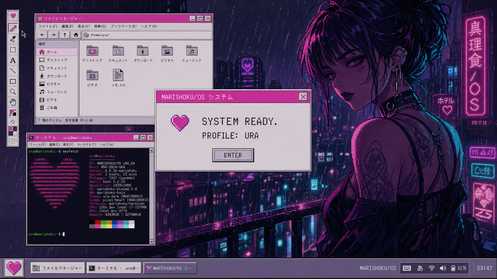
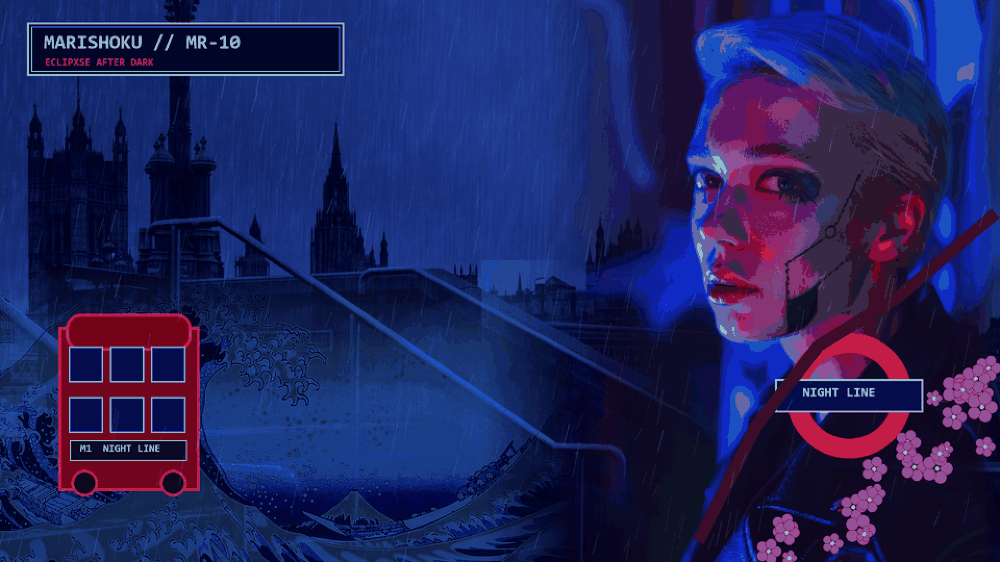
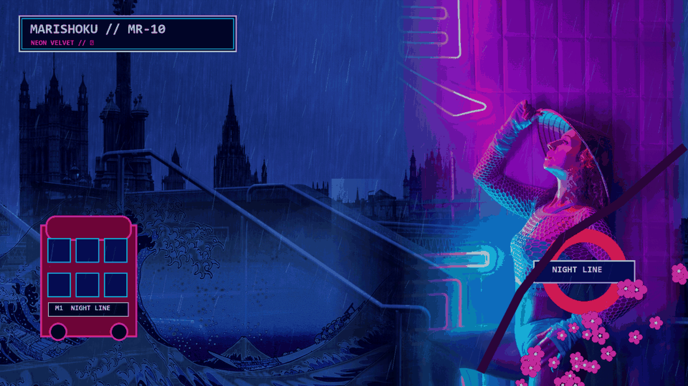

# 魔理蝕 // MARISHOKU/OS

`MARISHOKU/OS` is an installable Debian 13 remix built around KDE Plasma 6.
Its visual language combines hard-edged 1990s desktop chrome, handheld
messaging interfaces, pixel manga, CRT texture, and a magenta/cyan after-dark
palette.



## Identity

- Display name: `魔理蝕 // MARISHOKU/OS`
- System code: `MR-10`
- Device identity: `ECLIPXSE`
- Clean profile: `表 / OMOTE`
- After Dark profile: `裏 / URA`
- Primary architecture: `amd64`
- Base: Debian 13 stable
- Desktop: KDE Plasma 6 on Wayland

## Current milestone

Phase 1C is ready for visual review in the
Debian VM. This repository currently contains:

- the approved visual and interaction specification;
- hardware and content-profile requirements;
- a contrast-checked Plasma 6 color system;
- a Global Theme and Aurorae window decoration;
- original Plasma shell SVGs for panels, dialogs, buttons, fields, tasks,
  selections, headings, arrows, separators, and tooltips;
- an original Kvantum Qt 5/6 control atlas for application interiors;
- a Win9x grey taskbar, classic launcher layout, navy title bars, and icon MVP;
- two licensed, credited 1920x1080 London/cyber-goth wallpaper composites;
- Noto Sans/Mono typography with Japanese glyph fallback;
- installation and validation helpers.

The first ISO will be built only after the desktop theme passes visual review
inside a virtual machine.

## Repository map

```text
artwork/              Original source artwork and exports
docs/                 Product, visual, content, and hardware specifications
iso/                  Debian live-build configuration (Phase 2)
packages/             Debian packaging sources (Phase 2)
themes/               Plasma, Qt, GTK, SDDM, boot, icon, and cursor themes
tools/                Developer installation and validation helpers
```

## Test the Phase 1C desktop in a Plasma 6 VM

First-time setup installs the official Debian Kvantum and Noto packages:

```bash
./tools/install-theme.sh --install-deps --apply
```

Later theme-only updates do not need sudo:

```bash
./tools/install-theme.sh --apply
```

To deliberately rebuild the bottom taskbar and reset the wallpaper again:

```bash
./tools/install-theme.sh --apply --layout
```

Log out and back in once after the first application. The script installs into
the current user's home directory. Only `--install-deps` modifies the base OS,
through Debian's package manager.

## Included wallpaper profiles





The shipped composites use transformed Pexels photography and a public-domain
ukiyo-e image. Full source links, authors, and terms are recorded in
`ASSETS.yml`; the untouched source photos are not committed.

## Safety rule

Development is VM-first. No repartitioning, dual boot, NVIDIA driver changes,
or bootloader changes are performed on the ECLIPXSE host during theme development.
